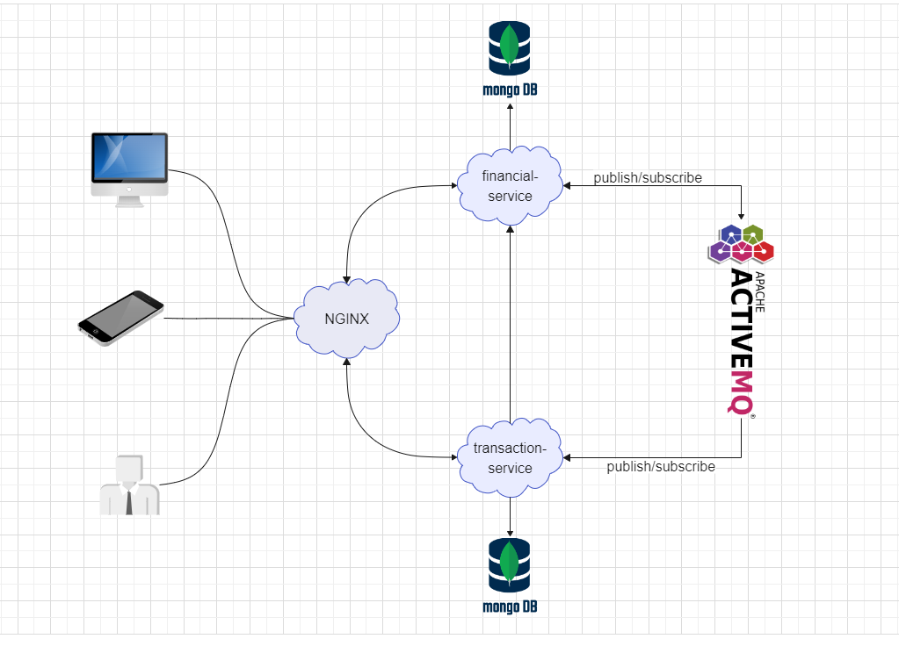

# PicPay Challenge

## Excecutar projeto

Para executar o projeto navegue para pasta /docker
Execute o comando (``docker compose up``) ou (``docker-compose up``).
PS:. depende da versao instalada do docker
     para arm based use a imagem ``image:andr94/artemis:arm64-v2.16.0`` (Subtistitua a ``linha: 4`` do arquivo /docker/docker-compose.yml)

## Usando a API

| Endpoints                                                    | HTTP method | Obs:.                         |
|--------------------------------------------------------------|-------------|-------------------------------|
| http://localhost:8080/api/v1/account                         | GET         | Lista todas as contas         |
| http://localhost:8080/api/v1/account/{id}                    | GET         | Retorna uma conta             |
| http://localhost:8080/api/v1/account                         | POST        | Cria uma conta                |
| http://localhost:8080/api/v1/transaction                     | POST        | Cria uma transacao financeira |
| http://localhost:8080/api/v1/transaction/account/{accountId} | GET         | Lista extrato do usuario      |

## Exemplos de request

### POST http://localhost:8080/api/v1/account
- body da requesicao:
    - ``````{
      {
        "name": "andre",
        "documentNumber": "10534",
        "wallet": {
            "amount": 5000,
            "type": "SAVINGS"
            }
        }
- Valores para wallet.type
    - SAVINGS
    - CHECKING

### GET http://localhost:8080/api/v1/account
- sem parametros

### GET http://localhost:8080/api/v1/account/{id}
- id retornado no POST account 

### POST http://localhost:8080/api/v1/transaction
- body da requisicao:
    - ````{
          {
            "accountHolderId": "637b024bbb9f5b459638231d",
            "beneficiaryId": "637ad94f19f51076b3cd5aa2",
            "amount": 2000,
             "type": "WIRE_TRANSFER"
          }
- Valores para type:
    - WIRE_TRANSFER
    - DEPOSIT
    - WITHDRAW
    - PAYMENT
- ``beneficiaryId`` só se faz necessario quanto o ``type`` for WIRE_TRANSFER
- ``accountHolderId`` valor rotornado no POST account
- ``beneficiaryId`` valor rotornado no POST account

### GET http://localhost:8080/api/v1/transaction/account/{accountId}
- ``accountId`` valor do ``beneficiaryId`` ou ``accountHolderId`` do POST transaction

## Densenho da solução

